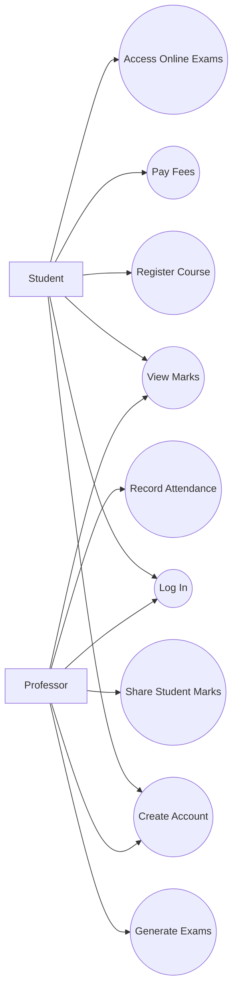
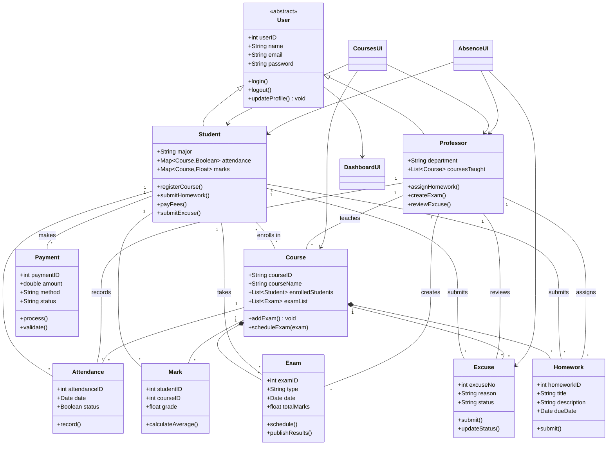
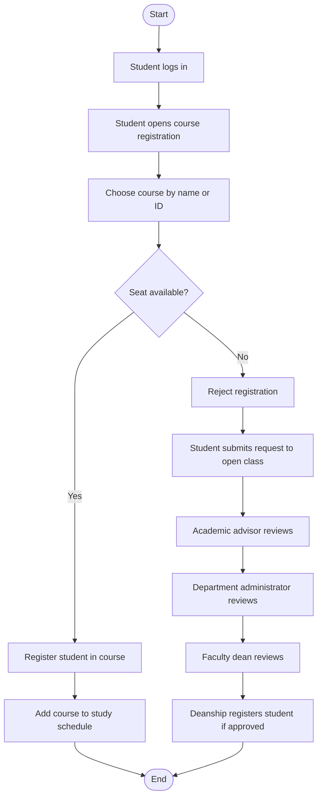
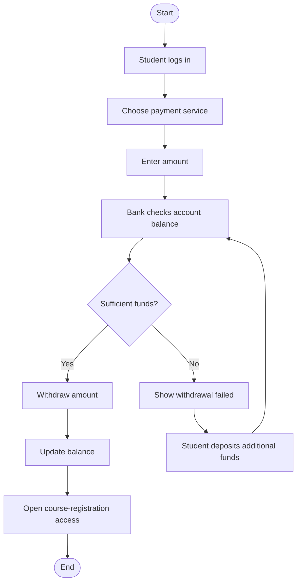
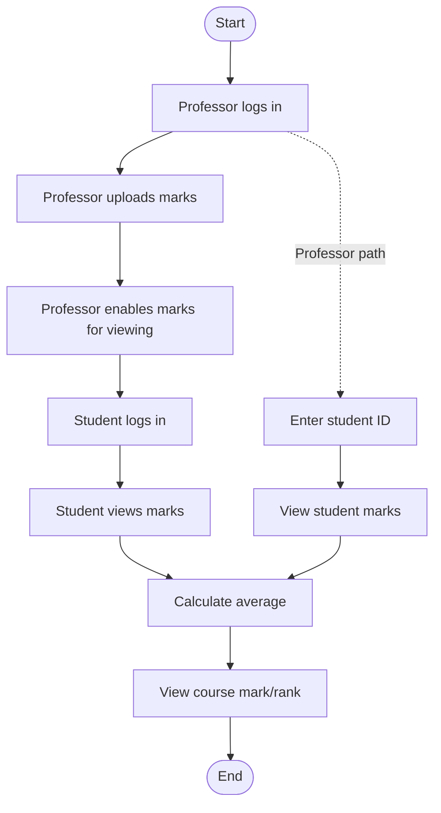

# GitHub-Rendered Diagrams

These Mermaid diagrams are portfolio-friendly recreations of the UML and activity diagrams from the original project material. They preserve the project structure and flows while making them viewable directly on GitHub.

## Use Case Overview

## Class Diagram

## Activity Diagram — UC-1 Register Course

## Activity Diagram — UC-2 Pay Fees

## Activity Diagram — UC-3 View Student Marks

## Source Note

The original project files also contain exported Draw.io images and editable Draw.io sources. This repository focuses on the analysis/design content itself, with Mermaid versions provided for direct GitHub rendering.
